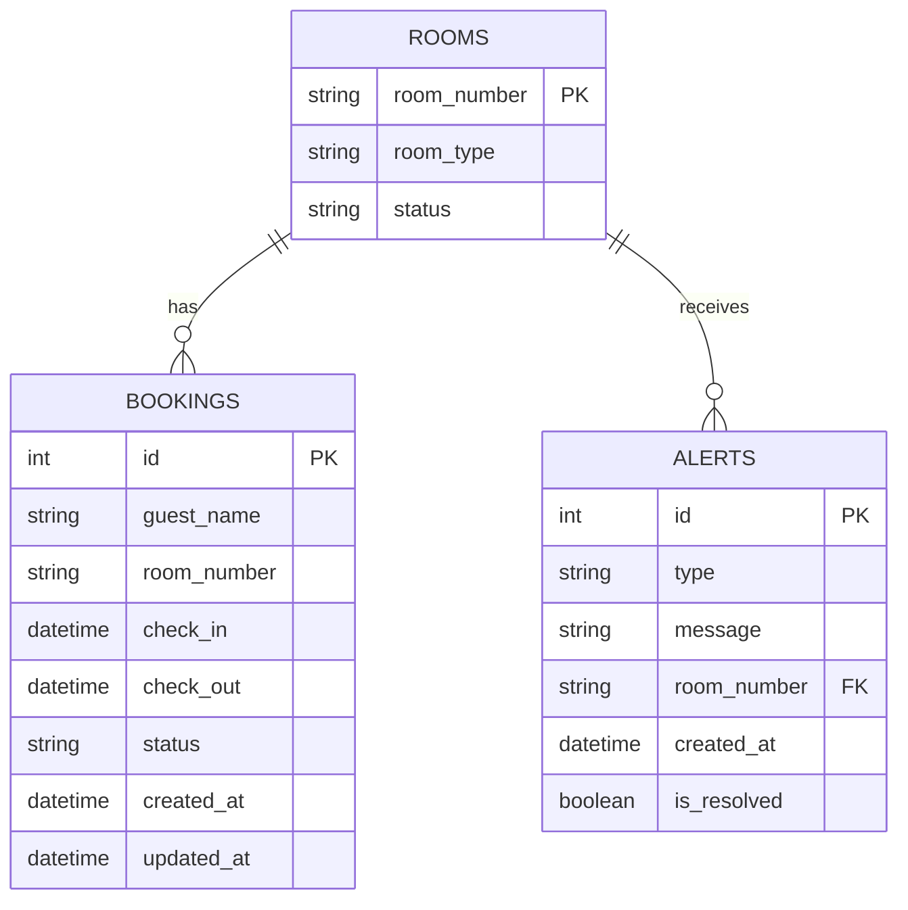

# Hotel Booking Management System

## Overview

The Hotel Booking Management System is a comprehensive web application designed to manage hotel bookings, alerts, and notifications. It provides a seamless interface for both hotel staff and guests, allowing for efficient booking management and real-time communication.

## Architecture Overview

The application follows a modern full-stack architecture with these key components:

* **Frontend - React**: Built using React.js for a dynamic and interactive user interface.
* **Backend - Node.js**: Utilizes Node.js with Express.js for handling API requests and WebSocket communication.
* **Database - SQLite**: Uses SQLite to store booking information and other data.

## Technology Stack

### Frontend
- **Framework**: React.js
- **State Management**: React Context API
- **WebSocket Client**: Socket.io-client
- **HTTP Client**: Axios
- **UI Framework**: Material-UI
- **Build Tool**: Webpack (via Create React App)

### Backend
- **Runtime**: Node.js
- **Web Framework**: Express.js
- **WebSocket Server**: Socket.io
- **Database ORM**: Sequelize
- **Authentication**: JWT (if needed in the future)
- **Validation**: Joi

### Database
- **SQLite**: Using the existing `hotel_bookings.db` file

## Project Structure

```
project-root/
├── frontend/                  # React frontend application
│   ├── public/                # Static files
│   ├── src/
│   │   ├── assets/            # Images, fonts, etc.
│   │   ├── components/        # Reusable UI components
│   │   │   ├── alerts/        # Alert-related components
│   │   │   ├── bookings/      # Booking-related components
│   │   │   └── common/        # Common UI components
│   │   ├── contexts/          # React contexts for state management
│   │   ├── hooks/             # Custom React hooks
│   │   ├── pages/             # Page components
│   │   ├── services/          # API and WebSocket services
│   │   ├── utils/             # Utility functions
│   │   ├── App.js             # Main App component
│   │   └── index.js           # Entry point
│   ├── package.json
│   └── README.md
│
├── backend/                   # Node.js backend application
│   ├── config/                # Configuration files
│   ├── controllers/           # Request handlers
│   │   ├── alertController.js # Alert system controllers
│   │   ├── bookingController.js # Booking-related controllers
│   │   └── notificationController.js # Notification controllers
│   ├── models/                # Database models
│   ├── routes/                # API route definitions
│   ├── services/              # Business logic
│   │   ├── databaseService.js # Database interaction service
│   │   ├── socketService.js   # WebSocket service
│   │   └── notificationService.js # Notification handling
│   ├── utils/                 # Utility functions
│   ├── app.js                 # Express application setup
│   ├── server.js              # Server entry point
│   ├── package.json
│   └── README.md
│
├── .gitignore
├── package.json               # Root package.json for scripts
└── README.md                  # Project documentation
```

## Features

### Backend Alert System

- **Alert Counter**: Keeps track of the number of active alerts.
- **WebSocket Events**: Broadcasts real-time updates to all connected clients.

### Database Integration Module

- **Booking Management**: CRUD operations for bookings.
- **Real-Time Updates**: Notifies clients of new or updated bookings.
- **Filtering Options**: Allows filtering bookings by date, status, etc.

### Laundry Alert Notification System

- **Notification Form**: Allows backend users to create notifications.
- **Room-Specific Targeting**: Sends notifications to specific rooms.
- **WebSocket Events**: Broadcasts notifications to targeted clients.

## Database Design



## API Endpoints

### Bookings API
- `GET /api/bookings` - Get all bookings
- `GET /api/bookings/upcoming` - Get upcoming bookings
- `GET /api/bookings/current` - Get current bookings
- `GET /api/bookings/past` - Get past bookings
- `GET /api/bookings/:id` - Get booking by ID
- `POST /api/bookings` - Create a new booking
- `PUT /api/bookings/:id` - Update a booking
- `DELETE /api/bookings/:id` - Delete a booking

### Alerts API
- `GET /api/alerts` - Get alert history
- `GET /api/alerts/count` - Get current alert count
- `POST /api/alerts` - Create a new alert
- `PUT /api/alerts/:id/resolve` - Resolve an alert

### Notifications API
- `GET /api/notifications` - Get all notifications
- `POST /api/notifications` - Create a new notification
- `GET /api/notifications/room/:roomNumber` - Get notifications for a specific room

## WebSocket Events

### Server to Client Events
- `alert_count_updated` - Broadcast updated alert count
- `new_booking` - Broadcast when a new booking is added
- `booking_updated` - Broadcast when a booking is updated
- `new_notification` - Send targeted notification

### Client to Server Events
- `trigger_alert` - Client triggers an alert
- `send_notification` - Send a notification to specific room(s)
- `join_room` - Join a specific notification room

## Implementation Plan

### Phase 1: Project Setup
1. Initialize project structure
2. Set up Express backend
3. Set up React frontend
4. Configure WebSocket connection
5. Connect to SQLite database

### Phase 2: Core Features
1. Implement database models and services
2. Create API endpoints
3. Implement alert counter system
4. Develop booking display and categorization
5. Create notification system

### Phase 3: Frontend Development
1. Build React components
2. Implement state management
3. Create UI for alerts, bookings, and notifications
4. Add filtering functionality
5. Implement real-time updates

### Phase 4: Testing & Refinement
1. Write unit tests
2. Perform integration testing
3. Optimize performance
4. Improve error handling
5. Refine UI/UX

### Phase 5: Deployment
1. Prepare for cloud hosting
2. Set up CI/CD pipeline
3. Configure production environment
4. Deploy application
5. Monitor performance

## Testing Strategy

### Unit Testing
- Test individual components and functions
- Use Jest for JavaScript testing
- Test database queries and models

### Integration Testing
- Test API endpoints
- Test WebSocket communication
- Test database integration

### End-to-End Testing
- Test complete user flows
- Verify real-time functionality
- Test across different browsers

## Deployment Considerations

### Cloud Hosting Options
- **AWS**: EC2 or Elastic Beanstalk
- **Google Cloud**: App Engine or Compute Engine
- **Heroku**: For simpler deployment
- **Vercel/Netlify**: For frontend hosting

### Deployment Architecture
```
Git Repository --> CI/CD Pipeline --> Build Process --> Frontend Deployment --> CDN
                                                                                              --> Backend Deployment --> API Server --> Database Setup
```

### Scaling Considerations
- Implement connection pooling for database
- Consider Redis for session management if needed
- Use load balancing for multiple instances
- Implement proper error handling and logging

## Error Handling Strategy

- Implement global error handling middleware
- Use try/catch blocks for async operations
- Create consistent error response format
- Log errors with appropriate severity levels
- Display user-friendly error messages on frontend

## Contributing

Contributions CLOSE
## License

Distributed under the MIT License. See `LICENSE` for more information.

## Contact

- **Email**: R.AJITH@RGU.AC.UK
