# Enterprise-Level Login System Plan

## Table of Contents
- [1. Introduction](#1-introduction)
- [2. System Architecture](#2-system-architecture)
- [3. Database Schema](#3-database-schema)
- [4. Authentication System](#4-authentication-system)
- [5. User Management](#5-user-management)
- [6. Frontend Implementation](#6-frontend-implementation)
- [7. Regulatory Compliance](#7-regulatory-compliance)
  - [7.1 GDPR Compliance](#71-gdpr-compliance)
  - [7.2 CCPA Compliance](#72-ccpa-compliance)
  - [7.3 Other Regional Regulations](#73-other-regional-regulations)
- [8. Security Measures](#8-security-measures)
- [9. Scalability Strategy](#9-scalability-strategy)
- [10. Implementation Roadmap](#10-implementation-roadmap)
- [11. Testing Strategy](#11-testing-strategy)
- [12. Monitoring and Operations](#12-monitoring-and-operations)
- [13. Dummy Data for Testing](#13-dummy-data-for-testing)

## 1. Introduction

This document outlines the plan for implementing an enterprise-level authentication system for a hotel management application that will scale globally. The system will support both hotel reception staff (with different roles) and hotel guests, with appropriate security measures and compliance with international regulations.

The authentication system will be designed to:
- Support multiple user types with different permission levels
- Scale globally across multiple properties and hotel chains
- Comply with international data protection regulations
- Provide a secure and seamless user experience
- Support both web and mobile interfaces

## 2. System Architecture

The system will follow a microservices architecture to enable scalability and maintainability.

### High-Level Architecture


### Authentication Flow


### Multi-Tenancy Architecture


## 3. Database Schema

The database schema will support multi-tenancy and user management with appropriate relationships.

### Core User Tables


### Authorization Tables


### Security and Audit Tables

```mermaid
erDiagram
    AUDIT_LOGS {
        int id PK
        int user_id FK
        string action
        string resource
        json details
        datetime timestamp
        string ip_address
    }
    
    LOGIN_ATTEMPTS {
        int id PK
        string email
        string ip_address
        boolean success
        datetime timestamp
    }
    
    PASSWORD_RESET_TOKENS {
        int id PK
        int user_id FK
        string token
        datetime expires_at
        boolean used
    }
    
    REFRESH_TOKENS {
        int id PK
        int user_id FK
        string token
        datetime expires_at
        boolean revoked
        string device_info
    }
    
    USERS ||--o{ AUDIT_LOGS : generates
    USERS ||--o{ PASSWORD_RESET_TOKENS : requests
    USERS ||--o{ REFRESH_TOKENS : owns
```



## 4. Authentication System

### 4.1 Authentication Service Endpoints

| Endpoint | Method | Description | Access |
|----------|--------|-------------|--------|
| `/api/auth/register` | POST | Register new guest users | Public |
| `/api/auth/login` | POST | Authenticate users and issue JWT | Public |
| `/api/auth/logout` | POST | Invalidate JWT (add to blacklist) | Authenticated |
| `/api/auth/refresh` | POST | Refresh JWT token | Authenticated |
| `/api/auth/me` | GET | Get current user profile | Authenticated |
| `/api/auth/password/reset-request` | POST | Request password reset | Public |
| `/api/auth/password/reset` | POST | Reset password with token | Public |
| `/api/auth/password/change` | POST | Change password | Authenticated |
| `/api/auth/mfa/setup` | POST | Set up multi-factor authentication | Authenticated |
| `/api/auth/mfa/verify` | POST | Verify MFA code | Authenticated |

### 4.2 JWT Implementation

- Use JSON Web Tokens for stateless authentication
- Include user ID, tenant ID, role, and permissions in token payload
- Set appropriate expiration time (e.g., 1 hour for access tokens)
- Implement token refresh mechanism with longer-lived refresh tokens
- Store tokens securely in HTTP-only cookies or localStorage

### 4.3 Multi-factor Authentication


### 4.4 Identity Provider Integration

For enterprise clients, support integration with external identity providers:


## 5. User Management

### 5.1 User Management API

| Endpoint | Method | Description | Access |
|----------|--------|-------------|--------|
| `/api/users` | GET | List users | Admin |
| `/api/users/:id` | GET | Get user details | Admin or Self |
| `/api/users` | POST | Create new user | Admin |
| `/api/users/:id` | PUT | Update user | Admin or Self |
| `/api/users/:id` | DELETE | Delete user | Admin |
| `/api/users/staff` | GET | List staff users | Admin |
| `/api/users/guests` | GET | List guest users | Admin, Manager |
| `/api/roles` | GET | List roles | Admin |
| `/api/roles` | POST | Create role | Admin |
| `/api/roles/:id` | PUT | Update role | Admin |
| `/api/roles/:id/permissions` | GET | Get role permissions | Admin |
| `/api/roles/:id/permissions` | PUT | Update role permissions | Admin |

### 5.2 User Onboarding Flows

#### Staff Onboarding


#### Guest Registration


## 6. Frontend Implementation

### 6.1 Authentication Components

#### 6.1.1 Shared Components
- Login form
- Password reset form
- Auth context provider (React Context API)
- Protected route wrapper

#### 6.1.2 Staff-specific Components
- Staff registration form (admin only)
- Role management interface
- User management dashboard

#### 6.1.3 Guest-specific Components
- Guest registration form
- Guest profile management
- Preference settings

### 6.2 Responsive Design Strategy


### 6.3 User Interface Mockups

#### Login Screen
- Clean, branded login interface
- Support for multiple authentication methods
- Password reset option
- Remember me functionality
- Error handling with clear messages

#### User Dashboard
- Role-specific dashboard views
- Quick access to frequently used features
- Notification center
- User profile access
- Session information

## 7. Regulatory Compliance

### 7.1 GDPR Compliance

The General Data Protection Regulation (GDPR) applies to all users in the European Union and European Economic Area.

#### 7.1.1 Key GDPR Requirements


#### 7.1.2 GDPR Implementation Plan

1. **Data Mapping**
   - Identify all personal data collected
   - Document data flows and processing activities
   - Establish lawful basis for each processing activity

2. **User Consent Management**
   - Implement clear consent mechanisms
   - Allow users to withdraw consent
   - Maintain consent records

3. **Data Subject Rights**
   - Implement API endpoints for data access requests
   - Create data export functionality
   - Develop data deletion processes

4. **Data Protection Measures**
   - Implement encryption for personal data
   - Establish access controls
   - Create data breach response plan

5. **Documentation**
   - Maintain Records of Processing Activities
   - Document security measures
   - Create Data Protection Impact Assessments for high-risk processing

#### 7.1.3 GDPR-Specific Database Tables


### 7.2 CCPA Compliance

The California Consumer Privacy Act (CCPA) applies to users in California.

#### 7.2.1 Key CCPA Requirements


#### 7.2.2 CCPA Implementation Plan

1. **Privacy Notice**
   - Update privacy policy with CCPA-required disclosures
   - Clearly describe categories of personal information collected
   - Disclose purposes for collection

2. **Consumer Rights Mechanisms**
   - Implement "Do Not Sell My Personal Information" option
   - Create processes for handling access and deletion requests
   - Establish verification procedures

3. **Data Inventory**
   - Categorize data according to CCPA definitions
   - Track data sharing with third parties
   - Document data sales (if applicable)

### 7.3 Other Regional Regulations

#### 7.3.1 Global Compliance Framework


#### 7.3.2 Implementation Strategy

1. **Geo-detection System**
   - Detect user location based on IP and explicit selection
   - Apply appropriate regulatory framework based on location

2. **Modular Compliance System**
   - Implement core compliance features (consent, access, deletion)
   - Add region-specific modules as needed

3. **Documentation and Monitoring**
   - Maintain compliance documentation for each region
   - Monitor regulatory changes
   - Regular compliance audits

## 8. Security Measures

### 8.1 Authentication Security


### 8.2 Data Protection

- **Encryption**:
  - Data at rest encryption
  - TLS for all communications
  - Field-level encryption for sensitive data

- **Access Controls**:
  - Role-based access control
  - Principle of least privilege
  - Regular access reviews

- **Secure Development**:
  - OWASP Top 10 mitigations
  - Regular security code reviews
  - Dependency vulnerability scanning

### 8.3 Security Monitoring

- **Audit Logging**:
  - Authentication events
  - Authorization decisions
  - Administrative actions
  - Data access logs

- **Threat Detection**:
  - Anomaly detection for login patterns
  - Geographic anomaly detection
  - Suspicious activity alerts

## 9. Scalability Strategy

### 9.1 Horizontal Scaling


### 9.2 Database Scaling

- **Read Replicas**:
  - Distribute read queries across multiple database instances
  - Primary database for writes, replicas for reads

- **Sharding Strategy**:
  - Shard by tenant ID
  - Each tenant's data on separate database shard
  - Cross-shard queries for global operations

- **Caching Layer**:
  - Cache frequently accessed user data
  - Cache authentication results
  - Distributed cache with Redis

### 9.3 Global Distribution


## 10. Implementation Roadmap

### Phase 1: Core Authentication (Months 1-2)
1. Set up basic authentication with JWT
2. Implement user registration and login
3. Create role-based access control

### Phase 2: Multi-tenancy (Months 3-4)
1. Implement tenant data isolation
2. Create tenant management interfaces
3. Develop property-level configurations

### Phase 3: Internationalization (Months 5-6)
1. Implement i18n framework
2. Add language selection
3. Translate core components

### Phase 4: Enterprise Features (Months 7-9)
1. Implement SSO integrations
2. Add multi-factor authentication
3. Develop audit logging and compliance reporting

### Phase 5: Scaling Infrastructure (Months 10-12)
1. Implement horizontal scaling
2. Set up distributed caching
3. Optimize database for global performance


## 11. Testing Strategy

### 11.1 Testing Pyramid


### 11.2 Test Automation

- **CI/CD Pipeline Integration**:
  - Automated tests on every commit
  - Deployment gates based on test results
  - Regular scheduled security scans

- **Test Data Management**:
  - Anonymized production data for testing
  - Synthetic data generation
  - Test data reset between test runs

## 12. Monitoring and Operations

### 12.1 Monitoring Strategy

```mermaid
graph TD
    A[Monitoring System] --> B[Service Health]
    A --> C[Performance Metrics]
    A --> D[Security Events]
    A --> E[User Activity]
    
    B --> F[Uptime Monitoring]
    B --> G[Error Rates]
    B --> H[Service Dependencies]
    
    C --> I[Response Times]
    C --> J[Resource Utilization]
    C --> K[Database Performance]
    
    D --> L[Authentication Failures]
    D --> M[Suspicious Activities]
    D --> N[Access Violations]
    
    E --> O[Login Patterns]
    E --> P[Feature Usage]
    E --> Q[User Satisfaction]
```

### 12.2 Alerting System

- **Alert Levels**:
  - Critical: Immediate response required
  - Warning: Investigation needed
  - Info: For awareness

- **Alert Channels**:
  - Email notifications
  - SMS for critical alerts
  - Integration with incident management systems

### 12.3 Disaster Recovery

- **Backup Strategy**:
  - Regular database backups
  - Point-in-time recovery
  - Geo-redundant storage

- **Failover Procedures**:
  - Automated failover for critical services
  - Manual failover procedures with runbooks
  - Regular failover testing

## 13. Dummy Data for Testing

### Staff Users:
1. Admin: Full access to all features
   - Email: admin@hotel.com
   - Password: Admin123!

2. Manager: Access to dashboard, bookings, and reports
   - Email: manager@hotel.com
   - Password: Manager123!

3. Receptionist: Access to bookings and guest management
   - Email: staff@hotel.com
   - Password: Staff123!

### Guest Users:
1. Test Guest 1:
   - Email: guest1@example.com
   - Password: Guest123!
   - Room: 101
   - Preferences: {"temperature": "72F", "cleaning": "morning"}

2. Test Guest 2:
   - Email: guest2@example.com
   - Password: Guest123!
   - Room: 202
   - Preferences: {"temperature": "68F", "cleaning": "afternoon"}