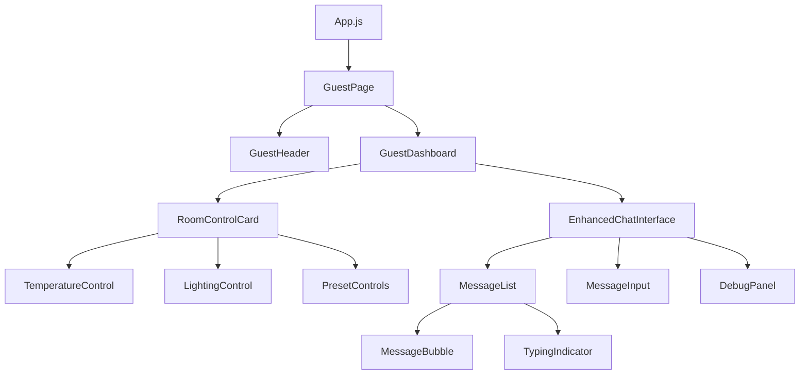

# Guest UI Technical Implementation Guide

## Component Architecture

This guide provides detailed technical specifications for implementing the guest UI components, focusing on the room controls and enhanced chatbot interface.

### Component Hierarchy



## 1. Room Control Components

### RoomControlContext

```jsx
// RoomControlContext.js
import React, { createContext, useState, useEffect } from 'react';

const RoomControlContext = createContext();

export const RoomControlProvider = ({ children }) => {
  // Initial state with default values
  const [temperature, setTemperature] = useState(23);
  const [brightness, setBrightness] = useState(70);
  const [colorTemp, setColorTemp] = useState(50); // 0-100 (warm to cool)
  const [activePreset, setActivePreset] = useState(null);
  
  // Load saved settings from localStorage on mount
  useEffect(() => {
    const savedSettings = localStorage.getItem('roomControlSettings');
    if (savedSettings) {
      const parsed = JSON.parse(savedSettings);
      setTemperature(parsed.temperature);
      setBrightness(parsed.brightness);
      setColorTemp(parsed.colorTemp);
      setActivePreset(parsed.activePreset);
    }
  }, []);
  
  // Save settings to localStorage when they change
  useEffect(() => {
    localStorage.setItem('roomControlSettings', JSON.stringify({
      temperature,
      brightness,
      colorTemp,
      activePreset
    }));
  }, [temperature, brightness, colorTemp, activePreset]);
  
  // Preset definitions
  const presets = {
    sleep: {
      name: 'Sleep',
      icon: '😴',
      temperature: 20,
      brightness: 10,
      colorTemp: 20 // Warm
    },
    reading: {
      name: 'Reading',
      icon: '📖',
      temperature: 23,
      brightness: 60,
      colorTemp: 30 // Warm
    },
    eco: {
      name: 'Eco',
      icon: '🌱',
      temperature: 25, // Summer setting (would be 19 in winter)
      brightness: 30,
      colorTemp: 70 // Cool
    },
    custom: {
      name: 'Custom',
      icon: '🏠',
      // Uses current settings
    }
  };
  
  // Apply a preset
  const applyPreset = (presetName) => {
    if (!presets[presetName]) return;
    
    const preset = presets[presetName];
    setTemperature(preset.temperature);
    setBrightness(preset.brightness);
    setColorTemp(preset.colorTemp);
    setActivePreset(presetName);
  };
  
  // Save current settings as custom preset
  const saveCustomPreset = () => {
    presets.custom = {
      ...presets.custom,
      temperature,
      brightness,
      colorTemp
    };
    setActivePreset('custom');
  };
  
  return (
    <RoomControlContext.Provider
      value={{
        temperature,
        setTemperature,
        brightness,
        setBrightness,
        colorTemp,
        setColorTemp,
        activePreset,
        setActivePreset,
        presets,
        applyPreset,
        saveCustomPreset
      }}
    >
      {children}
    </RoomControlContext.Provider>
  );
};

export const useRoomControl = () => {
  const context = React.useContext(RoomControlContext);
  if (!context) {
    throw new Error('useRoomControl must be used within a RoomControlProvider');
  }
  return context;
};
```

### TemperatureControl

```jsx
// Key implementation details for TemperatureControl.js
import React from 'react';
import { Slider, Typography, Box } from '@mui/material';
import { useRoomControl } from '../../contexts/RoomControlContext';

const TemperatureControl = () => {
  const { temperature, setTemperature } = useRoomControl();
  
  // Get color based on temperature (blue for cold, red for hot)
  const getTemperatureColor = (temp) => {
    // Linear gradient from blue (18°C) to red (30°C)
    const ratio = (temp - 18) / (30 - 18);
    const r = Math.round(ratio * 255);
    const b = Math.round((1 - ratio) * 255);
    return `rgb(${r}, 0, ${b})`;
  };
  
  return (
    <Box sx={{ mb: 3 }}>
      <Box sx={{ display: 'flex', justifyContent: 'space-between', mb: 1 }}>
        <Typography variant="h6">Temperature Control</Typography>
        <Typography 
          variant="h6" 
          sx={{ 
            color: getTemperatureColor(temperature),
            transition: 'color 0.3s ease'
          }}
        >
          {temperature}°C
        </Typography>
      </Box>
      
      <Slider
        value={temperature}
        min={18}
        max={30}
        step={0.5}
        onChange={(_, value) => setTemperature(value)}
        sx={{
          '& .MuiSlider-thumb': {
            backgroundColor: getTemperatureColor(temperature),
            transition: 'background-color 0.3s ease'
          },
          '& .MuiSlider-track': {
            background: 'linear-gradient(to right, #2196f3, #f44336)',
          }
        }}
      />
      
      <Box sx={{ display: 'flex', justifyContent: 'space-between', mt: 1 }}>
        <Typography variant="body2" color="text.secondary">18°C</Typography>
        <Typography variant="body2" color="text.secondary">30°C</Typography>
      </Box>
    </Box>
  );
};
```

### LightingControl

```jsx
// Key implementation details for LightingControl.js
import React from 'react';
import { Slider, Typography, Box } from '@mui/material';
import { useRoomControl } from '../../contexts/RoomControlContext';

const LightingControl = () => {
  const { brightness, setBrightness, colorTemp, setColorTemp } = useRoomControl();
  
  // Calculate preview background color based on brightness and color temp
  const getLightPreviewStyle = () => {
    // Convert brightness (0-100) to opacity (0.1-1)
    const opacity = 0.1 + (brightness / 100) * 0.9;
    
    // Convert colorTemp (0-100) from warm to cool
    // Warm: rgb(255, 244, 229) - Cool: rgb(240, 249, 255)
    const r = Math.round(255 - (colorTemp / 100) * 15);
    const g = Math.round(244 + (colorTemp / 100) * 5);
    const b = Math.round(229 + (colorTemp / 100) * 26);
    
    return {
      backgroundColor: `rgba(${r}, ${g}, ${b}, ${opacity})`,
      transition: 'background-color 0.5s ease',
      height: '80px',
      borderRadius: '8px',
      border: '1px solid rgba(0,0,0,0.1)',
      display: 'flex',
      alignItems: 'center',
      justifyContent: 'center'
    };
  };
  
  return (
    <Box sx={{ mb: 3 }}>
      <Typography variant="h6" sx={{ mb: 1 }}>Lighting Control</Typography>
      
      <Typography variant="body2" sx={{ mb: 0.5 }}>
        Brightness: {brightness}%
      </Typography>
      <Slider
        value={brightness}
        min={0}
        max={100}
        onChange={(_, value) => setBrightness(value)}
        sx={{ mb: 2 }}
      />
      
      <Typography variant="body2" sx={{ mb: 0.5 }}>
        Color Temperature
      </Typography>
      <Slider
        value={colorTemp}
        min={0}
        max={100}
        onChange={(_, value) => setColorTemp(value)}
        sx={{ mb: 2 }}
      />
      
      <Box sx={{ display: 'flex', justifyContent: 'space-between', mb: 1 }}>
        <Typography variant="body2" color="text.secondary">Warm</Typography>
        <Typography variant="body2" color="text.secondary">Cool</Typography>
      </Box>
      
      <Typography variant="body2" sx={{ mb: 0.5 }}>Preview:</Typography>
      <Box style={getLightPreviewStyle()}>
        <Box 
          sx={{ 
            width: '30px', 
            height: '30px', 
            borderRadius: '50%', 
            background: 'radial-gradient(circle, rgba(255,255,255,1) 0%, rgba(255,255,255,0) 70%)',
            opacity: brightness / 100
          }} 
        />
      </Box>
    </Box>
  );
};
```

### PresetControls

```jsx
// Key implementation details for PresetControls.js
import React from 'react';
import { Button, Typography, Box, Grid, Paper } from '@mui/material';
import { useRoomControl } from '../../contexts/RoomControlContext';

const PresetControls = () => {
  const { presets, applyPreset, activePreset } = useRoomControl();
  
  // Convert presets object to array for mapping
  const presetArray = Object.entries(presets).map(([key, preset]) => ({
    id: key,
    ...preset
  }));
  
  return (
    <Box sx={{ mb: 3 }}>
      <Typography variant="h6" sx={{ mb: 2 }}>Preset Controls</Typography>
      
      <Grid container spacing={2}>
        {presetArray.map((preset) => (
          <Grid item xs={6} key={preset.id}>
            <Button
              fullWidth
              variant={activePreset === preset.id ? "contained" : "outlined"}
              onClick={() => applyPreset(preset.id)}
              sx={{
                height: '80px',
                transition: 'all 0.3s ease',
                borderWidth: activePreset === preset.id ? 2 : 1,
                boxShadow: activePreset === preset.id ? 3 : 0,
                display: 'flex',
                flexDirection: 'column'
              }}
            >
              <Typography variant="h5" sx={{ mb: 1 }}>{preset.icon}</Typography>
              <Typography variant="body2">{preset.name}</Typography>
            </Button>
          </Grid>
        ))}
      </Grid>
      
      {activePreset && (
        <Paper sx={{ mt: 2, p: 2, bgcolor: 'rgba(0,0,0,0.02)' }}>
          <Typography variant="subtitle2">
            Active Preset: {presets[activePreset].name}
          </Typography>
          <Typography variant="body2">
            • Temperature: {presets[activePreset].temperature}°C
          </Typography>
          <Typography variant="body2">
            • Brightness: {presets[activePreset].brightness}%
          </Typography>
          <Typography variant="body2">
            • Color: {presets[activePreset].colorTemp < 50 ? 'Warm' : 'Cool'}
          </Typography>
        </Paper>
      )}
    </Box>
  );
};
```

## 2. Enhanced Chatbot Components

### EnhancedChatInterface

```jsx
// Key implementation details for EnhancedChatInterface.js
import React, { useState, useEffect, useRef } from 'react';
import { 
  Box, Paper, Typography, TextField, Button, IconButton, 
  CircularProgress, Collapse, Divider
} from '@mui/material';
import SendIcon from '@mui/icons-material/Send';
import ExpandMoreIcon from '@mui/icons-material/ExpandMore';
import ExpandLessIcon from '@mui/icons-material/ExpandLess';
import DeleteIcon from '@mui/icons-material/Delete';
import axios from 'axios';

import MessageBubble from './MessageBubble';
import TypingIndicator from './TypingIndicator';
import DebugPanel from './DebugPanel';

const API_URL = process.env.REACT_APP_API_URL || 'http://localhost:8001/api';

const EnhancedChatInterface = () => {
  const [messages, setMessages] = useState([]);
  const [input, setInput] = useState('');
  const [loading, setLoading] = useState(false);
  const [error, setError] = useState(null);
  const [showDebug, setShowDebug] = useState(false);
  const [debugInfo, setDebugInfo] = useState({
    lastMessageStatus: 'none',
    responseSource: 'none',
    apiDetails: null,
    agentInfo: null
  });
  
  const messagesEndRef = useRef(null);
  
  // Initialize with welcome message
  useEffect(() => {
    if (messages.length === 0) {
      setMessages([
        {
          role: 'system',
          content: 'Welcome to our hotel AI assistant! How can I help you today?',
          timestamp: new Date().toISOString()
        }
      ]);
    }
  }, [messages]);
  
  // Scroll to bottom when messages change
  useEffect(() => {
    scrollToBottom();
  }, [messages]);
  
  const scrollToBottom = () => {
    messagesEndRef.current?.scrollIntoView({ behavior: 'smooth' });
  };
  
  const handleSendMessage = async (e) => {
    e?.preventDefault();
    
    if (!input.trim()) return;
    
    const userMessage = {
      role: 'user',
      content: input,
      timestamp: new Date().toISOString()
    };
    
    setMessages(prev => [...prev, userMessage]);
    setInput('');
    setError(null);
    setLoading(true);
    
    // Update debug info - message sent
    setDebugInfo(prev => ({
      ...prev,
      lastMessageStatus: 'sending',
      apiDetails: {
        ...prev.apiDetails,
        requestTime: new Date().toISOString(),
        endpoint: `${API_URL}/chatbot`
      }
    }));
    
    try {
      // Prepare history for the API
      const history = messages.map(msg => ({
        role: msg.role === 'system' ? 'system' : (msg.role === 'user' ? 'user' : 'assistant'),
        content: msg.content
      }));
      
      const startTime = Date.now();
      
      // Send message to API
      const response = await axios.post(`${API_URL}/chatbot`, {
        message: userMessage.content,
        history
      });
      
      const endTime = Date.now();
      const responseTime = (endTime - startTime) / 1000;
      
      // Update debug info - response received
      setDebugInfo(prev => ({
        ...prev,
        lastMessageStatus: 'received',
        responseSource: 'LangGraph API',
        apiDetails: {
          ...prev.apiDetails,
          responseTime: `${responseTime.toFixed(2)}s`,
          statusCode: 200
        },
        agentInfo: response.data.agent_outputs ? {
          activeAgent: Object.keys(response.data.agent_outputs)[0] || 'unknown',
          confidence: response.data.agent_outputs ? 
            (response.data.agent_outputs[Object.keys(response.data.agent_outputs)[0]]?.confidence || 'N/A') : 
            'N/A'
        } : null
      }));
      
      // Add assistant response to messages
      setMessages(prev => [
        ...prev,
        {
          role: 'assistant',
          content: response.data.response,
          timestamp: new Date().toISOString()
        }
      ]);
      
    } catch (error) {
      console.error('Error sending message:', error);
      
      // Update debug info - error
      setDebugInfo(prev => ({
        ...prev,
        lastMessageStatus: 'error',
        apiDetails: {
          ...prev.apiDetails,
          statusCode: error.response?.status || 'Network Error',
          error: error.response?.data?.message || error.message
        }
      }));
      
      setError('Failed to get a response. Please try again.');
      
      // Add error message
      setMessages(prev => [
        ...prev,
        {
          role: 'error',
          content: 'Sorry, I encountered an error processing your request. Please try again.',
          timestamp: new Date().toISOString()
        }
      ]);
    } finally {
      setLoading(false);
    }
  };
  
  const handleClearChat = () => {
    setMessages([]);
    setDebugInfo({
      lastMessageStatus: 'none',
      responseSource: 'none',
      apiDetails: null,
      agentInfo: null
    });
  };
  
  return (
    <Paper 
      elevation={3} 
      sx={{ 
        height: '100%', 
        display: 'flex', 
        flexDirection: 'column',
        overflow: 'hidden',
        borderRadius: 2
      }}
    >
      {/* Header */}
      <Box 
        sx={{ 
          p: 2, 
          bgcolor: 'primary.main', 
          color: 'white',
          display: 'flex',
          justifyContent: 'space-between',
          alignItems: 'center'
        }}
      >
        <Typography variant="h6">Hotel AI Assistant</Typography>
        <Box>
          <IconButton 
            size="small" 
            color="inherit" 
            onClick={() => setShowDebug(!showDebug)}
            sx={{ mr: 1 }}
          >
            {showDebug ? <ExpandLessIcon /> : <ExpandMoreIcon />}
          </IconButton>
          <IconButton 
            size="small" 
            color="inherit" 
            onClick={handleClearChat}
          >
            <DeleteIcon />
          </IconButton>
        </Box>
      </Box>
      
      {/* Debug Panel */}
      <Collapse in={showDebug}>
        <DebugPanel debugInfo={debugInfo} />
      </Collapse>
      
      {/* Messages Container */}
      <Box 
        sx={{ 
          flex: 1, 
          overflow: 'auto', 
          p: 2,
          display: 'flex',
          flexDirection: 'column',
          gap: 1
        }}
      >
        {messages.map((message, index) => (
          <MessageBubble 
            key={index} 
            message={message} 
            isLatest={index === messages.length - 1}
          />
        ))}
        
        {loading && <TypingIndicator />}
        
        <div ref={messagesEndRef} />
      </Box>
      
      {/* Input Area */}
      <Box 
        component="form" 
        onSubmit={handleSendMessage}
        sx={{ 
          p: 2, 
          borderTop: '1px solid', 
          borderColor: 'divider',
          display: 'flex',
          alignItems: 'center',
          gap: 1
        }}
      >
        <TextField
          fullWidth
          variant="outlined"
          placeholder="Type your message..."
          value={input}
          onChange={(e) => setInput(e.target.value)}
          disabled={loading}
          size="small"
          sx={{
            '& .MuiOutlinedInput-root': {
              borderRadius: 4
            }
          }}
        />
        
        <Button
          variant="contained"
          color="primary"
          endIcon={<SendIcon />}
          disabled={!input.trim() || loading}
          type="submit"
          sx={{ borderRadius: 4 }}
        >
          Send
        </Button>
      </Box>
    </Paper>
  );
};
```

### MessageBubble

```jsx
// Key implementation details for MessageBubble.js
import React from 'react';
import { Paper, Typography, Box } from '@mui/material';
import { keyframes } from '@mui/system';

// Animation keyframes
const fadeIn = keyframes`
  from {
    opacity: 0;
    transform: translateY(10px);
  }
  to {
    opacity: 1;
    transform: translateY(0);
  }
`;

const MessageBubble = ({ message, isLatest }) => {
  const isUser = message.role === 'user';
  const isError = message.role === 'error';
  
  // Format timestamp
  const formatTime = (timestamp) => {
    if (!timestamp) return '';
    const date = new Date(timestamp);
    return date.toLocaleTimeString([], { hour: '2-digit', minute: '2-digit' });
  };
  
  return (
    <Box
      sx={{
        display: 'flex',
        justifyContent: isUser ? 'flex-end' : 'flex-start',
        mb: 1,
        animation: isLatest ? `${fadeIn} 0.3s ease` : 'none'
      }}
    >
      <Paper
        elevation={1}
        sx={{
          p: 2,
          maxWidth: '80%',
          bgcolor: isError ? 'error.light' : (isUser ? 'primary.light' : 'background.paper'),
          color: isError ? 'error.contrastText' : (isUser ? 'primary.contrastText' : 'text.primary'),
          borderRadius: isUser 
            ? '20px 20px 5px 20px' 
            : '20px 20px 20px 5px'
        }}
      >
        <Typography 
          variant="body2" 
          sx={{ 
            fontWeight: 'bold',
            mb: 0.5
          }}
        >
          {isUser ? 'You' : (isError ? 'Error' : 'Hotel AI')}
        </Typography>
        
        <Typography variant="body1">
          {message.content}
        </Typography>
        
        <Typography 
          variant="caption" 
          sx={{ 
            display: 'block',
            textAlign: 'right',
            mt: 1,
            opacity: 0.7
          }}
        >
          {formatTime(message.timestamp)}
        </Typography>
      </Paper>
    </Box>
  );
};
```

### TypingIndicator

```jsx
// Key implementation details for TypingIndicator.js
import React from 'react';
import { Paper, Box } from '@mui/material';
import { keyframes } from '@mui/system';

// Animation keyframes
const bounce = keyframes`
  0%, 80%, 100% {
    transform: translateY(0);
  }
  40% {
    transform: translateY(-5px);
  }
`;

const TypingIndicator = () => {
  return (
    <Box
      sx={{
        display: 'flex',
        justifyContent: 'flex-start',
        mb: 1
      }}
    >
      <Paper
        elevation={1}
        sx={{
          p: 2,
          borderRadius: '20px 20px 20px 5px',
          display: 'flex',
          alignItems: 'center',
          justifyContent: 'center'
        }}
      >
        <Box
          sx={{
            display: 'flex',
            alignItems: 'center',
            gap: 0.5
          }}
        >
          {[0, 1, 2].map((i) => (
            <Box
              key={i}
              sx={{
                width: '8px',
                height: '8px',
                borderRadius: '50%',
                backgroundColor: 'primary.main',
                animation: `${bounce} 1.4s ease-in-out ${i * 0.16}s infinite both`
              }}
            />
          ))}
        </Box>
      </Paper>
    </Box>
  );
};
```

### DebugPanel

```jsx
// Key implementation details for DebugPanel.js
import React, { useState } from 'react';
import { 
  Box, Paper, Typography, Divider, Chip, 
  Collapse, IconButton
} from '@mui/material';
import CodeIcon from '@mui/icons-material/Code';
import ExpandMoreIcon from '@mui/icons-material/ExpandMore';

const DebugPanel = ({ debugInfo }) => {
  const [showRawJson, setShowRawJson] = useState(false);
  
  // Get status color
  const getStatusColor = (status) => {
    switch (status) {
      case 'sending': return 'warning.main';
      case 'received': return 'success.main';
      case 'error': return 'error.main';
      default: return 'text.disabled';
    }
  };
  
  // Get status text
  const getStatusText = (status) => {
    switch (status) {
      case 'sending': return 'Sending...';
      case 'received': return 'Received';
      case 'error': return 'Error';
      default: return 'No messages sent';
    }
  };
  
  return (
    <Paper
      sx={{
        p: 2,
        m: 1,
        bgcolor: 'rgba(0,0,0,0.03)',
        borderRadius: 1
      }}
    >
      <Box sx={{ display: 'flex', justifyContent: 'space-between', alignItems: 'center', mb: 1 }}>
        <Typography variant="subtitle2">Debug Information</Typography>
        <Chip 
          label={getStatusText(debugInfo.lastMessageStatus)}
          size="small"
          sx={{ 
            bgcolor: getStatusColor(debugInfo.lastMessageStatus),
            color: 'white'
          }}
        />
      </Box>
      
      <Divider sx={{ my: 1 }} />
      
      <Typography variant="body2">
        <strong>Message Status:</strong> {debugInfo.lastMessageStatus}
      </Typography>
      
      <Typography variant="body2">
        <strong>Response Source:</strong> {debugInfo.responseSource}
      </Typography>
      
      {debugInfo.apiDetails && (
        <>
          <Typography variant="body2" sx={{ mt: 1 }}>
            <strong>API Details:</strong>
          </Typography>
          <Typography variant="body2" sx={{ pl: 2 }}>
            • Endpoint: {debugInfo.apiDetails.endpoint}
          </Typography>
          {debugInfo.apiDetails.responseTime && (
            <Typography variant="body2" sx={{ pl: 2 }}>
              • Response Time: {debugInfo.apiDetails.responseTime}
            </Typography>
          )}
          {debugInfo.apiDetails.statusCode && (
            <Typography variant="body2" sx={{ pl: 2 }}>
              • Status Code: {debugInfo.apiDetails.statusCode}
            </Typography>
          )}
          {debugInfo.apiDetails.error && (
            <Typography variant="body2" sx={{ pl: 2, color: 'error.main' }}>
              • Error: {debugInfo.apiDetails.error}
            </Typography>
          )}
        </>
      )}
      
      {debugInfo.agentInfo && (
        <>
          <Typography variant="body2" sx={{ mt: 1 }}>
            <strong>Agent Information:</strong>
          </Typography>
          <Typography variant="body2" sx={{ pl: 2 }}>
            • Active Agent: {debugInfo.agentInfo.activeAgent}
          </Typography>
          <Typography variant="body2" sx={{ pl: 2 }}>
            • Confidence: {debugInfo.agentInfo.confidence}
          </Typography>
        </>
      )}
      
      <Box sx={{ display: 'flex', alignItems: 'center', mt: 1 }}>
        <IconButton 
          size="small" 
          onClick={() => setShowRawJson(!showRawJson)}
          sx={{ mr: 1 }}
        >
          {showRawJson ? <ExpandMoreIcon fontSize="small" /> : <CodeIcon fontSize="small" />}
        </IconButton>
        <Typography variant="body2">
          {showRawJson ? 'Hide Raw JSON' : 'Show Raw JSON'}
        </Typography>
      </Box>
      
      <Collapse in={showRawJson}>
        <Paper
          sx={{
            p: 1,
            mt: 1,
            bgcolor: 'rgba(0,0,0,0.05)',
            borderRadius: 1,
            overflow: 'auto',
            maxHeight: '100px'
          }}
        >
          <Typography variant="caption" component="pre" sx={{ m: 0 }}>
            {JSON.stringify(debugInfo, null, 2)}
          </Typography>
        </Paper>
      </Collapse>
    </Paper>
  );
};
```

## 3. Main Page Components

### GuestPage

```jsx
// Key implementation details for GuestPage.js
import React from 'react';
import { Container, Grid, Box, Typography } from '@mui/material';
import GuestHeader from '../components/common/GuestHeader';
import GuestDashboard from '../components/guest/GuestDashboard';
import { RoomControlProvider } from '../contexts/RoomControlContext';

const GuestPage = () => {
  return (
    <Box sx={{ display: 'flex', flexDirection: 'column', minHeight: '100vh' }}>
      <GuestHeader />
      
      <Container component="main" sx={{ flexGrow: 1, py: 3 }}>
        <Typography variant="h4" component="h1" sx={{ mb: 4 }}>
          Welcome to Your Room Controls
        </Typography>
        
        <RoomControlProvider>
          <GuestDashboard />
        </RoomControlProvider>
      </Container>
      
      <Box
        component="footer"
        sx={{
          py: 3,
          px: 2,
          mt: 'auto',
          backgroundColor: (theme) =>
            theme.palette.mode === 'light'
              ? theme.palette.grey[200]
              : theme.palette.grey[800],
        }}
      >
        <Container maxWidth="sm">
          <Typography variant="body2" color="text.secondary" align="center">
            © {new Date().getFullYear()} Luxury Hotel Experience
          </Typography>
        </Container>
      </Box>
    </Box>
  );
};
```

### GuestDashboard

```jsx
// Key implementation details for GuestDashboard.js
import React from 'react';
import { Grid, Paper, Box, Typography } from '@mui/material';
import RoomControlCard from './RoomControlCard';
import EnhancedChatInterface from './EnhancedChatbot/EnhancedChatInterface';

const GuestDashboard = () => {
  return (
    <Grid container spacing={3}>
      {/* Room Controls */}
      <Grid item xs={12} md={5}>
        <RoomControlCard />
      </Grid>
      
      {/* Chatbot Interface */}
      <Grid item xs={12} md={7}>
        <Box sx={{ height: '600px' }}>
          <EnhancedChatInterface />
        </Box>
      </Grid>
    </Grid>
  );
};
```

### RoomControlCard

```jsx
// Key implementation details for RoomControlCard.js
import React from 'react';
import { Paper, Box, Typography, Divider } from '@mui/material';
import TemperatureControl from './RoomControls/TemperatureControl';
import LightingControl from './RoomControls/LightingControl';
import PresetControls from './RoomControls/PresetControls';

const RoomControlCard = () => {
  return (
    <Paper 
      elevation={3} 
      sx={{ 
        p: 3, 
        height: '100%',
        borderRadius: 2
      }}
    >
      <Typography variant="h5" component="h2" sx={{ mb: 3 }}>
        Room Controls
      </Typography>
      
      <TemperatureControl />
      
      <Divider sx={{ my: 2 }} />
      
      <LightingControl />
      
      <Divider sx={{ my: 2 }} />
      
      <PresetControls />
    </Paper>
  );
};
```

## 4. App.js Updates

```jsx
// Key updates for App.js
import React from 'react';
import { BrowserRouter as Router, Route, Routes } from 'react-router-dom';
import Dashboard from './pages/Dashboard';
import Bookings from './pages/Bookings';
import Notifications from './pages/Notifications';
import Alerts from './pages/Alerts';
import LandingPage from './pages/LandingPage';
import GuestPage from './pages/GuestPage'; // New import
import Layout from './components/common/Layout';
import Login from './components/auth/Login';
import Register from './components/auth/Register';
import ForgotPassword from './components/auth/ForgotPassword';
import ResetPassword from './components/auth/ResetPassword';
import ProtectedRoute from './components/auth/ProtectedRoute';
import { AuthProvider } from './contexts/AuthContext';
import './App.css';

// Unauthorized component
const Unauthorized = () => (
  <div style={{ padding: '2rem', textAlign: 'center' }}>
    <h1>Unauthorized</h1>
    <p>You do not have permission to access this page.</p>
  </div>
);

function App() {
  return (
    <AuthProvider>
      <Router>
        <Routes>
          {/* Public routes */}
          <Route path="/" element={<Layout><LandingPage /></Layout>} />
          <Route path="/login" element={<Login />} />
          <Route path="/register" element={<Register />} />
          <Route path="/forgot-password" element={<ForgotPassword />} />
          <Route path="/reset-password" element={<ResetPassword />} />
          <Route path="/unauthorized" element={<Unauthorized />} />
          
          {/* Guest routes */}
          <Route
            element={
              <ProtectedRoute
                allowedRoles={['guest']}
                redirectPath="/unauthorized"
              />
            }
          >
            <Route path="/guest" element={<GuestPage />} />
          </Route>
          
          {/* Protected routes for all authenticated users */}
          <Route element={<ProtectedRoute />}>
            <Route element={<Layout />}>
              <Route path="/dashboard" element={<Dashboard />} />
              <Route path="/bookings" element={<Bookings />} />
              <Route path="/notifications" element={<Notifications />} />
              <Route path="/alerts" element={<Alerts />} />
            </Route>
          </Route>
          
          {/* Protected routes for staff and admin */}
          <Route
            element={
              <ProtectedRoute
                allowedRoles={['admin', 'manager', 'staff']}
                redirectPath="/unauthorized"
              />
            }
          >
            <Route element={<Layout />}>
              <Route path="/admin/dashboard" element={<Dashboard />} />
              {/* Add more admin routes here */}
            </Route>
          </Route>
        </Routes>
      </Router>
    </AuthProvider>
  );
}

export default App;
```

## 5. Implementation Notes

### CSS Animations

For smooth animations, use these CSS keyframes in a separate styles file:

```css
@keyframes fadeIn {
  from {
    opacity: 0;
    transform: translateY(10px);
  }
  to {
    opacity: 1;
    transform: translateY(0);
  }
}

@keyframes pulse {
  0% {
    transform: scale(1);
  }
  50% {
    transform: scale(1.05);
  }
  100% {
    transform: scale(1);
  }
}

@keyframes typing {
  0%, 80%, 100% {
    transform: translateY(0);
  }
  40% {
    transform: translateY(-5px);
  }
}

@keyframes colorShift {
  0% {
    filter: hue-rotate(0deg);
  }
  100% {
    filter: hue-rotate(360deg);
  }
}
```

### Performance Considerations

1. **Memoization**: Use React.memo for components that don't need frequent re-renders
2. **Debouncing**: Implement debouncing for sliders to prevent excessive state updates
3. **Lazy Loading**: Use React.lazy for components that aren't immediately needed
4. **Virtualization**: For long message lists, consider using react-window for virtualization

### Accessibility

1. Add proper ARIA labels to all controls
2. Ensure keyboard navigation works for all interactive elements
3. Provide sufficient color contrast for all text
4. Include screen reader announcements for status changes

### Testing

1. Create unit tests for individual components
2. Implement integration tests for component interactions
3. Test on different screen sizes for responsive design
4. Test with keyboard-only navigation