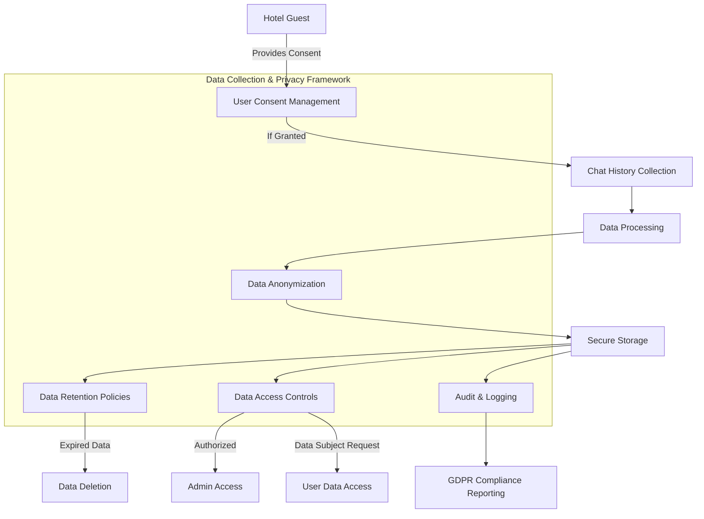

# Implementation Plan for Hotel AI Assistant with LangGraph Multi-Agent System

## 1. System Architecture Overview

```mermaid
graph TD
    subgraph "Frontend (React)"
        UI[Guest UI Interface]
        AdminUI[Admin Dashboard]
    end
    
    subgraph "Backend (Node.js + Python)"
        API[Express API Server]
        Socket[Socket.IO Server]
        Bridge[Python-Node.js Bridge]
        
        subgraph "LangGraph Multi-Agent System"
            Supervisor[Supervisor Agent]
            
            subgraph "Guest-Facing Agents"
                CheckIn[Check-in Agent]
                RoomService[Room Service Agent]
                Entertainment[Entertainment Agent]
                CabBooking[Cab Booking Agent]
                ExtendStay[Extend Stay Agent]
                Laundry[Laundry Alert Agent]
                StockUp[Stock-up Agent]
                DoorAccess[Door Access Agent]
                TripPlanner[Trip Planner Agent]
                FoodRec[Food Recommendation Agent]
                Complaints[Complaints Agent]
                Wellness[Wellness Agent]
                Booking[Booking Agent]
                TimeAware[Time-Aware Agent]
                Events[Events Agent]
                Reminder[Reminder Agent]
            end
            
            subgraph "Admin-Facing Agents"
                RequestManager[Request Manager Agent]
                AlertAgent[Alert Agent]
                RAGAdmin[RAG Admin Agent]
                ItineraryAgent[Itinerary Agent]
                EventsAdmin[Events Admin Agent]
                ApprovalAgent[Approval Agent]
                AnalyticsAgent[Analytics Agent]
            end
        end
        
        DB[(SQLite/PostgreSQL)]
        RAG[RAG Knowledge Base]
    end
    
    UI --> API
    AdminUI --> API
    UI <--> Socket
    AdminUI <--> Socket
    
    API --> Bridge
    Bridge --> Supervisor
    
    Supervisor --> CheckIn
    Supervisor --> RoomService
    Supervisor --> Entertainment
    Supervisor --> CabBooking
    Supervisor --> ExtendStay
    Supervisor --> Laundry
    Supervisor --> StockUp
    Supervisor --> DoorAccess
    Supervisor --> TripPlanner
    Supervisor --> FoodRec
    Supervisor --> Complaints
    Supervisor --> Wellness
    Supervisor --> Booking
    Supervisor --> TimeAware
    Supervisor --> Events
    Supervisor --> Reminder
    
    Supervisor --> RequestManager
    Supervisor --> AlertAgent
    Supervisor --> RAGAdmin
    Supervisor --> ItineraryAgent
    Supervisor --> EventsAdmin
    Supervisor --> ApprovalAgent
    Supervisor --> AnalyticsAgent
    
    CheckIn --> DB
    RoomService --> DB
    Laundry --> DB
    ExtendStay --> DB
    Booking --> DB
    
    Events --> RAG
    RAGAdmin --> RAG
    
    Bridge --> API
    Socket --> UI
    Socket --> AdminUI
```



## 2. Technical Stack Enhancements

### 2.1 New Dependencies
- **LangGraph**: For building multi-agent workflows
- **Pydantic-AI**: For schema enforcement and inter-agent validation
- **LangChain**: For RAG implementation and agent tools
- **FastAPI**: For creating a Python API server to host the LangGraph system
- **SQLAlchemy**: For database interactions from Python agents

### 2.2 Integration Architecture
We'll create a hybrid architecture where:
1. The existing Node.js backend will continue to serve the React frontend
2. A new Python FastAPI server will host the LangGraph multi-agent system
3. The Node.js backend will communicate with the Python server via HTTP/WebSockets

## 3. Implementation Phases

### Phase 1: Setup and Core Infrastructure

1. **Setup Python Environment**
   - Create a new Python virtual environment
   - Install required dependencies (LangGraph, Pydantic-AI, FastAPI, etc.)
   - Set up project structure for the Python backend

2. **Define Agent Schemas with Pydantic-AI**
   - Create base schemas for agent communication
   - Define input/output schemas for each agent type
   - Implement validation logic for agent messages

3. **Create FastAPI Server**
   - Set up FastAPI application
   - Create endpoints for agent communication
   - Implement WebSocket support for real-time updates

4. **Integrate with Node.js Backend**
   - Modify the existing chatbot bridge to communicate with the FastAPI server
   - Update the Node.js controllers to handle agent responses
   - Implement event handling for real-time updates

### Phase 2: Core Agent Implementation

1. **Implement Supervisor Agent**
   - Create the central supervisor agent using LangGraph
   - Define routing logic for delegating tasks to specialized agents
   - Implement conversation history management

2. **Implement Base Agent Classes**
   - Create abstract base classes for different agent types
   - Implement common functionality (memory, tools, etc.)
   - Set up testing framework for agents

3. **Implement Three Sample Agents**
   - **CheckInAgent**: For handling guest check-ins
   - **RoomServiceAgent**: For processing room service requests
   - **WellnessAgent**: For providing wellness services

4. **Create Agent Tools**
   - Implement database access tools
   - Create API integration tools (for CRM, cab booking, etc.)
   - Develop utility tools for common tasks

### Phase 3: Admin Dashboard Integration

1. **Update Admin Dashboard**
   - Create new components for agent-triggered updates
   - Implement real-time notification system
   - Add approval workflow for agent decisions

2. **Implement Admin-Facing Agents**
   - Create RequestManager agent for handling guest requests
   - Implement AlertAgent for critical notifications
   - Develop RAGAdmin agent for knowledge base management

3. **Create Analytics System**
   - Implement logging for agent actions
   - Create analytics dashboard for agent performance
   - Set up reporting system for agent workflows

### Phase 4: Guest-Facing Features

1. **Enhance Guest UI**
   - Update chatbot interface for multi-agent interactions
   - Add specialized interfaces for different services
   - Implement real-time status updates

2. **Implement Remaining Guest-Facing Agents**
   - Develop agents for all required guest services
   - Integrate with external APIs (cab booking, entertainment, etc.)
   - Implement time-aware reasoning

3. **Create RAG Knowledge Base**
   - Set up vector database for hotel information
   - Implement RAG retrieval system
   - Create admin interface for updating knowledge base

### Phase 5: Testing and Deployment

1. **Unit Testing**
   - Test individual agents
   - Validate schema enforcement
   - Verify tool functionality

2. **Integration Testing**
   - Test agent workflows
   - Verify database interactions
   - Test external API integrations

3. **End-to-End Testing**
   - Test complete user journeys
   - Verify real-time updates
   - Test error handling and recovery

4. **Deployment**
   - Set up production environment
   - Configure environment variables
   - Deploy application

## 4. Detailed Component Design

### 4.1 Agent Schema Design (Pydantic-AI)

```python
# Base message schema
class AgentMessage(BaseModel):
    id: str
    timestamp: datetime
    sender: str
    recipient: str
    content: str
    metadata: Dict[str, Any] = {}

# Agent input schema
class AgentInput(BaseModel):
    messages: List[AgentMessage]
    context: Dict[str, Any] = {}
    
# Agent output schema
class AgentOutput(BaseModel):
    messages: List[AgentMessage]
    actions: List[Dict[str, Any]] = []
    status: str
    metadata: Dict[str, Any] = {}

# Specialized schemas for specific agents
class CheckInInput(AgentInput):
    booking_id: Optional[str] = None
    guest_name: Optional[str] = None
    
class RoomServiceInput(AgentInput):
    room_number: Optional[str] = None
    request_type: Optional[str] = None
    
class WellnessInput(AgentInput):
    session_type: Optional[str] = None
    duration: Optional[int] = None
```

### 4.2 LangGraph Flow Design

```python
# Supervisor agent flow
def create_hotel_supervisor(agents, model):
    # Define the state schema
    class SupervisorState(TypedDict):
        messages: List[Dict[str, str]]
        current_agent: Optional[str]
        agent_outputs: Dict[str, Any]
        
    # Create the supervisor workflow
    workflow = StateGraph(SupervisorState)
    
    # Add nodes for each agent
    for agent in agents:
        workflow.add_node(agent.name, agent)
    
    # Add supervisor node
    workflow.add_node("supervisor", supervisor_agent)
    
    # Define the routing logic
    def route_message(state):
        # Logic to determine which agent to route to
        return state["current_agent"]
    
    # Add edges
    workflow.add_edge("supervisor", route_message)
    
    # Set entry point
    workflow.set_entry_point("supervisor")
    
    return workflow
```

### 4.3 FastAPI Server Design

```python
# FastAPI application
app = FastAPI()

# Create the LangGraph workflow
agents = [
    CheckInAgent(),
    RoomServiceAgent(),
    WellnessAgent(),
    # Add more agents as needed
]
supervisor = create_hotel_supervisor(agents, model)

# API endpoint for processing messages
@app.post("/api/chat")
async def process_message(request: ChatRequest):
    # Process the message using the supervisor
    result = supervisor.invoke({
        "messages": request.messages,
        "current_agent": None,
        "agent_outputs": {}
    })
    
    return result

# WebSocket endpoint for real-time updates
@app.websocket("/ws")
async def websocket_endpoint(websocket: WebSocket):
    await websocket.accept()
    
    # Handle WebSocket messages
    while True:
        data = await websocket.receive_text()
        # Process the message and send updates
        # ...
```

### 4.4 Node.js Integration Design

```javascript
// Updated chatbot controller
const processMessage = async (req, res) => {
  try {
    const { message, history = [] } = req.body;

    // Call the Python FastAPI server
    const response = await axios.post('http://localhost:8000/api/chat', {
      messages: [
        ...history,
        { role: 'user', content: message }
      ]
    });

    // Process the response
    const result = response.data;
    
    // Update the admin dashboard if needed
    if (result.actions && result.actions.length > 0) {
      // Process actions (e.g., update database, send notifications)
      processAgentActions(result.actions);
    }
    
    return res.json({ response: result.messages });
  } catch (error) {
    console.error('Error processing chatbot message:', error);
    return res.status(500).json({ error: 'Internal server error' });
  }
};
```

## 5. Database Schema Updates

We'll need to update the database schema to support the new multi-agent system:

```sql
-- Agent actions table
CREATE TABLE agent_actions (
    id INTEGER PRIMARY KEY AUTOINCREMENT,
    agent_id TEXT NOT NULL,
    action_type TEXT NOT NULL,
    action_data TEXT NOT NULL,
    status TEXT NOT NULL,
    created_at TIMESTAMP DEFAULT CURRENT_TIMESTAMP,
    updated_at TIMESTAMP DEFAULT CURRENT_TIMESTAMP
);

-- Agent conversations table
CREATE TABLE agent_conversations (
    id INTEGER PRIMARY KEY AUTOINCREMENT,
    conversation_id TEXT NOT NULL,
    user_id TEXT,
    agent_id TEXT NOT NULL,
    message TEXT NOT NULL,
    role TEXT NOT NULL,
    created_at TIMESTAMP DEFAULT CURRENT_TIMESTAMP
);

-- Agent approvals table
CREATE TABLE agent_approvals (
    id INTEGER PRIMARY KEY AUTOINCREMENT,
    action_id INTEGER NOT NULL,
    approved_by TEXT,
    status TEXT NOT NULL,
    notes TEXT,
    created_at TIMESTAMP DEFAULT CURRENT_TIMESTAMP,
    FOREIGN KEY (action_id) REFERENCES agent_actions (id)
);
```

## 6. Implementation Timeline

1. **Week 1: Setup and Core Infrastructure**
   - Set up Python environment
   - Define agent schemas
   - Create FastAPI server
   - Integrate with Node.js backend

2. **Week 2: Core Agent Implementation**
   - Implement supervisor agent
   - Create base agent classes
   - Implement sample agents
   - Develop agent tools

3. **Week 3: Admin Dashboard Integration**
   - Update admin dashboard
   - Implement admin-facing agents
   - Create analytics system

4. **Week 4: Guest-Facing Features**
   - Enhance guest UI
   - Implement remaining guest-facing agents
   - Create RAG knowledge base

5. **Week 5: Testing and Deployment**
   - Unit testing
   - Integration testing
   - End-to-end testing
   - Deployment

## 7. Testing Strategy

1. **Unit Tests**
   - Test individual agents in isolation
   - Validate schema enforcement
   - Verify tool functionality

2. **Integration Tests**
   - Test agent workflows
   - Verify database interactions
   - Test external API integrations

3. **End-to-End Tests**
   - Test complete user journeys
   - Verify real-time updates
   - Test error handling and recovery

## 8. Deployment Strategy

1. **Development Environment**
   - Local development with Docker Compose
   - Automated testing with GitHub Actions

2. **Staging Environment**
   - Deploy to staging server
   - Manual testing and validation

3. **Production Environment**
   - Blue-green deployment
   - Monitoring and logging
   - Backup and recovery

## 9. Ethical Data Collection & GDPR Compliance



### 9.1 Consent Management System

We'll implement a robust consent management system that:

1. **Explicit Consent Collection**:
   - Implement a clear consent dialog before chat interactions begin
   - Provide granular consent options (service improvement, analytics, etc.)
   - Store consent records with timestamps and consent version

2. **Consent Withdrawal**:
   - Allow users to withdraw consent at any time
   - Implement automated data deletion upon consent withdrawal
   - Provide confirmation of data deletion

3. **Consent Versioning**:
   - Track consent policy versions
   - Prompt for re-consent when policies change
   - Maintain audit trail of consent changes

### 9.2 Data Anonymization Pipeline

To protect user privacy while still enabling system improvements:

1. **Real-time Anonymization**:
   - Remove personally identifiable information (PII) before storage
   - Replace identifiers with pseudonyms
   - Separate identity data from conversation content

2. **Differential Privacy**:
   - Implement noise addition techniques for analytics
   - Ensure individual conversations cannot be re-identified
   - Apply k-anonymity to aggregated data

3. **Data Minimization**:
   - Only collect data necessary for stated purposes
   - Automatically filter sensitive information
   - Implement regular data purging

### 9.3 GDPR Compliance Framework

To ensure compliance with GDPR and other privacy regulations:

1. **Data Subject Rights**:
   - Implement "Right to Access" functionality
   - Support "Right to be Forgotten" with complete data deletion
   - Enable data portability with standardized export formats

2. **Data Protection Impact Assessment**:
   - Conduct and document DPIA for the chat system
   - Identify and mitigate privacy risks
   - Regular reassessment as features change

3. **Breach Response Protocol**:
   - Implement detection systems for unauthorized access
   - Create notification workflow for affected users
   - Maintain documentation for regulatory reporting

### 9.4 Database Schema for Privacy Management

```sql
-- Consent records table
CREATE TABLE user_consent (
    id INTEGER PRIMARY KEY AUTOINCREMENT,
    user_id TEXT NOT NULL,
    service_improvement BOOLEAN DEFAULT FALSE,
    analytics BOOLEAN DEFAULT FALSE,
    model_training BOOLEAN DEFAULT FALSE,
    marketing BOOLEAN DEFAULT FALSE,
    consent_version TEXT NOT NULL,
    ip_address TEXT,
    consent_timestamp TIMESTAMP DEFAULT CURRENT_TIMESTAMP,
    last_updated TIMESTAMP DEFAULT CURRENT_TIMESTAMP
);

-- Anonymized conversations table
CREATE TABLE anonymized_conversations (
    id INTEGER PRIMARY KEY AUTOINCREMENT,
    anonymized_user_id TEXT NOT NULL,
    conversation_id TEXT NOT NULL,
    message_type TEXT NOT NULL,
    message_content TEXT NOT NULL,
    intent_category TEXT,
    sentiment_score REAL,
    created_at TIMESTAMP DEFAULT CURRENT_TIMESTAMP,
    retention_expires_at TIMESTAMP
);

-- Data deletion requests table
CREATE TABLE data_deletion_requests (
    id INTEGER PRIMARY KEY AUTOINCREMENT,
    user_id TEXT NOT NULL,
    request_type TEXT NOT NULL,
    status TEXT NOT NULL,
    requested_at TIMESTAMP DEFAULT CURRENT_TIMESTAMP,
    completed_at TIMESTAMP,
    verification_token TEXT,
    notes TEXT
);

-- Data access log
CREATE TABLE data_access_log (
    id INTEGER PRIMARY KEY AUTOINCREMENT,
    data_type TEXT NOT NULL,
    user_id TEXT,
    accessed_by TEXT NOT NULL,
    access_reason TEXT NOT NULL,
    access_timestamp TIMESTAMP DEFAULT CURRENT_TIMESTAMP,
    ip_address TEXT
);
```

### 9.5 Implementation Steps for Privacy Framework

1. **Week 1: Consent Management System**
   - Develop consent UI components
   - Implement consent storage and retrieval
   - Create consent versioning system

2. **Week 2: Anonymization Pipeline**
   - Implement PII detection algorithms
   - Create anonymization service
   - Set up secure storage for anonymized data

3. **Week 3: GDPR Compliance Tools**
   - Develop data subject request handling
   - Implement data export functionality
   - Create data deletion workflows

4. **Week 4: Audit and Monitoring**
   - Set up access logging
   - Implement breach detection
   - Create compliance reporting dashboard